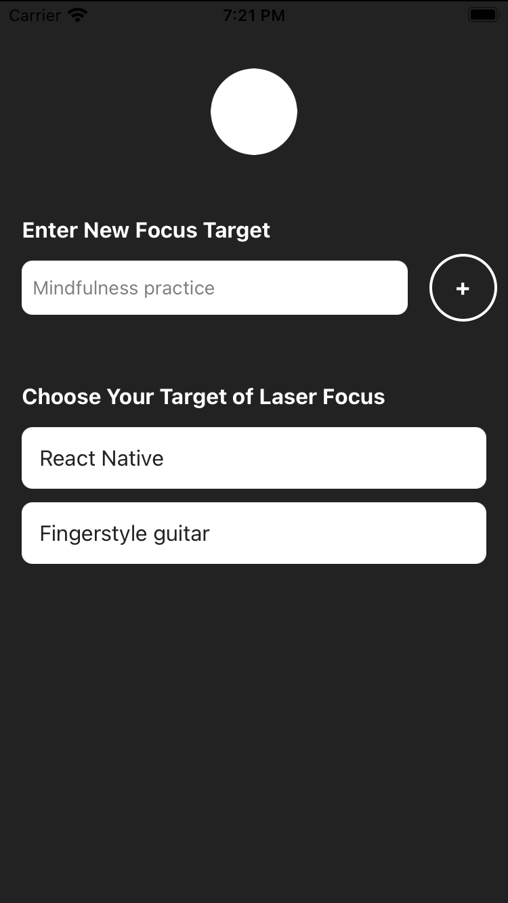
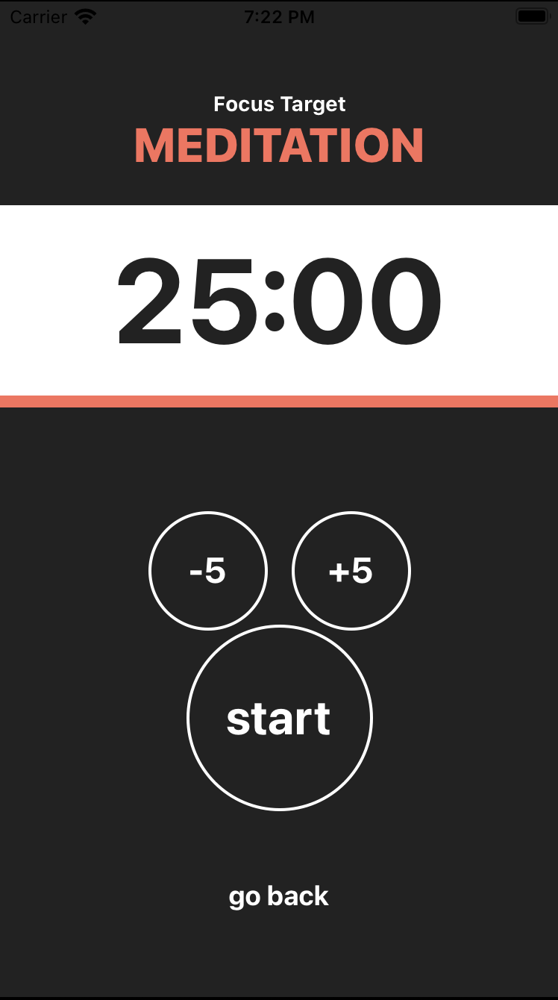

# FocusTime

Greetings and welcome to the FocusTime App! This is part of my educational journey through the "Complete React Native in 2023: Zero to Mastery (with Hooks)" course on Udemy, where I cultivated my skills in mobile app development.

## Features

- **User-Friendly Interface:** An intuitive design makes it easy to set and manage timers.
- **Customizable Presets:** Completed timers are saved and quickly accessible for your common goals.
- **Visual and Tactile Alerts:** Stay on track with clear notifications.
- **Elegant Design:** A minimalist aesthetic ensures a distraction-free experience.

| Home screen              | Timer screen                 |
| ------------------------ | ---------------------------- |
|  |  |
